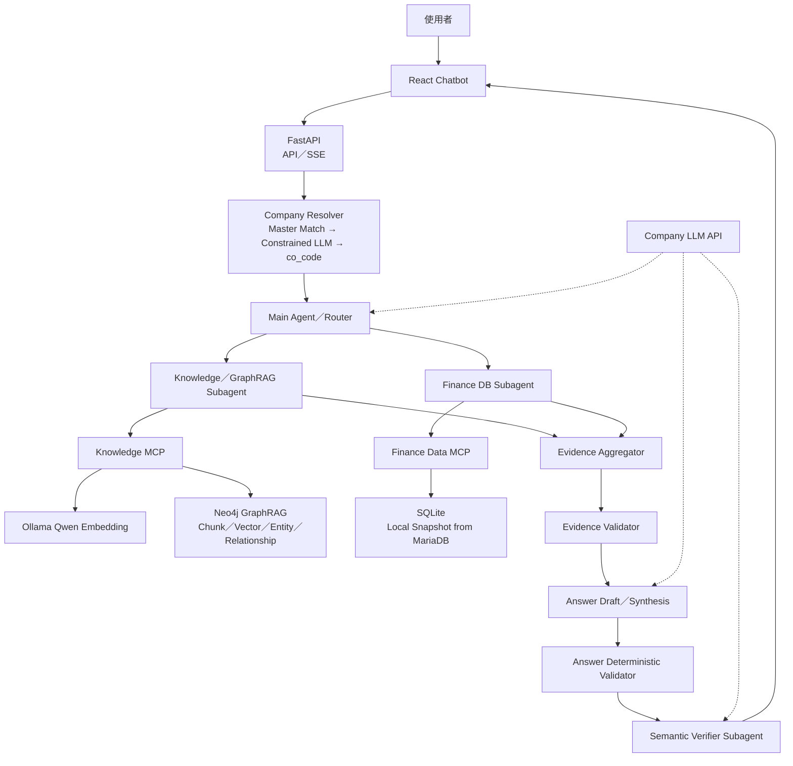
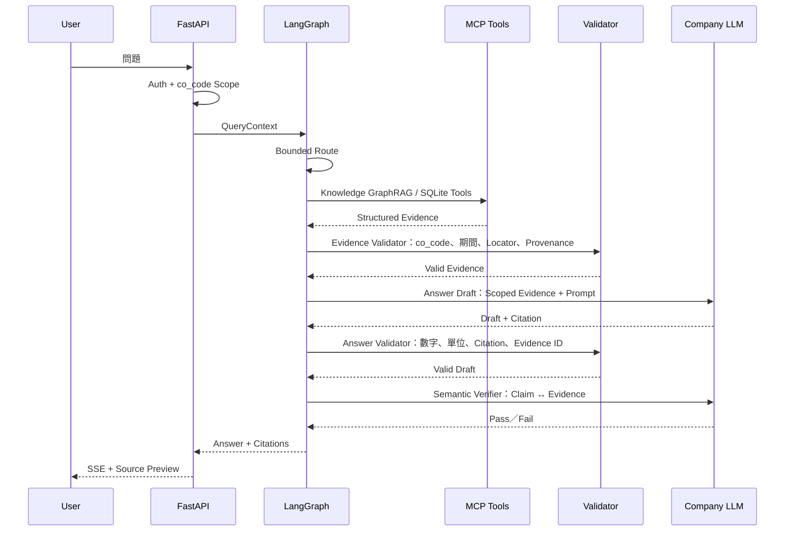
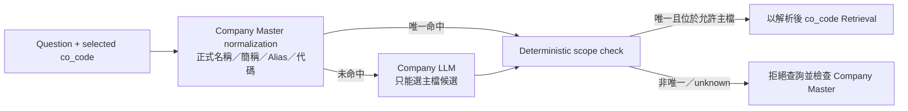
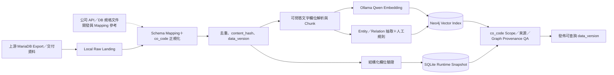
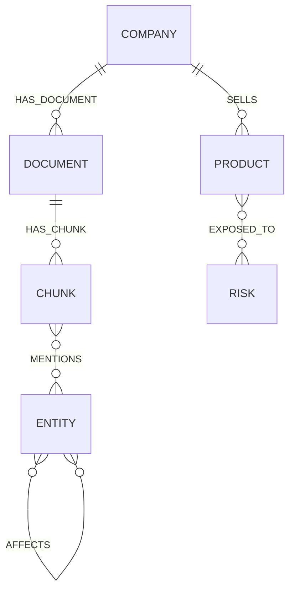
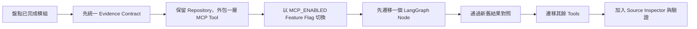
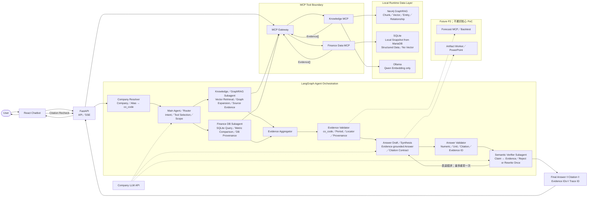
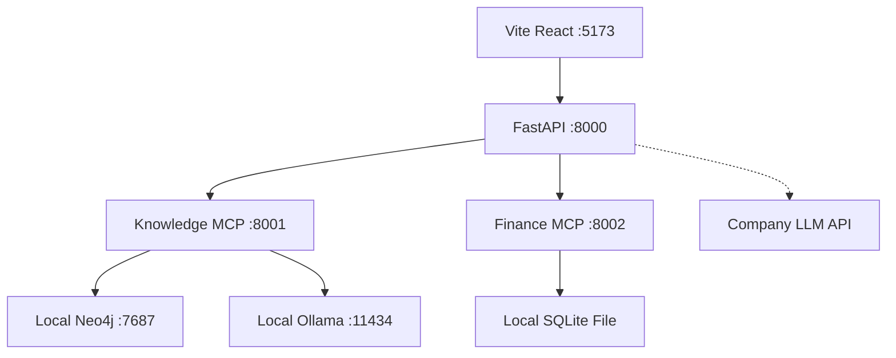

# Local-first Financial Multi-Agent GraphRAG＋MCP PoC

> 狀態：可執行 PoC 基線，未確認的公司規格以 Adapter／Mapping 保留。\
> 公司關聯鍵：`co_code`\
> Embedding：Ollama Qwen Embedding\
> Runtime 結構化資料庫：本機 SQLite（由上游 MariaDB 匯出）\
> 生成模型：公司 LLM API

## 1. 目標

本 PoC 用於驗證：將上游 MariaDB 資料匯出至本機 SQLite，並將可供問答的文字內容以 `co_code`、來源定位與資料版本寫入 Neo4j GraphRAG，透過 Ollama Qwen Embedding 建立 Chunk Vector 與 Graph 關聯檢索，再由 LangGraph 編排受控 Agent，經 MCP 調用 GraphRAG／SQLite 工具、確定性驗證及公司 LLM API，產生能定位至 Neo4j Chunk、Graph Path 或 SQLite Record 的答案。公司 API／DB 規格文件僅供開發、Schema Mapping 與 Adapter 實作參考，預設不作為 Runtime 問答來源。

## 2. 為什麼採合併架構

- LangGraph 提供固定狀態、分支、重試上限及可測試流程。
- MCP 僅作為標準工具邊界，讓 RAG／DB 能獨立部署與重用。
- Main Agent 不任意產生 Agent，也不執行任意 SQL／Cypher。
- Verifier Agent 不能取代程式驗證；數字、`co_code`、來源及期間先由程式檢查。

| 選項                         | 優點            | 主要風險                   | 本 PoC 決定 |
| -------------------------- | ------------- | ---------------------- | -------- |
| 原本的固定 RAG Pipeline         | 最容易測試、行為穩定    | 工具擴充與跨服務重用較弱           | 保留固定流程核心 |
| 全自主 Main／Sub Agent＋MCP     | 擴充彈性高         | 路由漂移、工具誤用、驗證難重現        | 不採全自主模式  |
| LangGraph＋受控 Sub Agent＋MCP | 流程可稽核，工具可獨立部署 | 需要維護 Evidence Contract | **採用**   |

## 3. 整體架構



## 4. Query Flow



### 4.1 公司解析與資料範圍

Company Resolver 在任何文件、Graph 或財務資料查詢之前執行：



- 問題沒有提到公司時，沿用 UI／API 選定的 `co_code`。
- 問題提到一家公司時，唯一解析結果成為實際查詢 `co_code`；若與 UI 選項不同，Response 回傳解析後代碼並讓 UI 同步切換。
- 產品契約規定每個問題只針對一家公司；若 Resolver 得到多個候選，視為 Alias／Company Master 歧義並停止 Retrieval，不視為跨公司查詢需求。
- LLM 回傳的代碼必須存在於允許的 Company Master；未知或自行生成的代碼不能進入 Retrieval。
- SQLite、Neo4j Vector、Graph Path 與 Source Preview 都再次使用已確認的同一 `co_code`，不只依賴 Resolver。

## 5. 本機資料匯入流程



PoC 不在問答時讀取上游 MariaDB。正式匯入以批次 Export、CDC 或檔案交付三選一，資料落地為本機 SQLite；在公司規格確認前，程式只提供 `data/raw`、Schema Adapter 與可重跑初始化範例。公司 API／DB 規格文件只用來定義 Mapping、欄位語意與 Adapter，不預設建立 Embedding，也不作為使用者答案 Evidence。

## 6. Graph 關聯模型



每個 Node／Relationship 必須保存 `co_code` 或可追溯至 Company，且關聯至少帶 `source_id`、`period`、`data_version`；沒有來源的推論關聯不能作為答案 Evidence。

## 7. 元件責任

| 元件             | 責任                                      | 不負責           |
| -------------- | --------------------------------------- | ------------- |
| React          | Chat 與答案／Citation／Source Preview 呈現        | Agent 路由與資料授權判斷 |
| FastAPI        | API／SSE 邊界，轉交 Tenant 與 `co_code` Context   | 任意模型決策        |
| LangGraph      | Main Agent、受控 Subagent、驗證與一次修正上限          | 資料庫實作         |
| Knowledge MCP  | Scoped Chunk Vector／Graph／Evidence 查詢       | 生成最終答案        |
| Finance MCP    | 受控 SQLite 財務指標與 Provenance 工具              | 任意 SQL        |
| SQLite         | MariaDB 本機快照、結構化財務資料、資料版本與 DB Provenance | Vector Search |
| Neo4j GraphRAG | Chunk、Vector、Entity、Relation、Provenance | 業務交易主檔        |
| Ollama         | Qwen Embedding                          | 生成式回答         |
| Company LLM    | Route、摘要、回答、語意驗證                          | 決定授權範圍        |

### 7.1 Agent 與 Subagent 責任

| Agent／Node | 主要責任 | 工具邊界 |
| --- | --- | --- |
| Company Resolver | 先以 Company Master 確定性比對名稱／Alias／代碼；未命中時才讓 LLM 從主檔候選中判斷 | Finance MCP `resolve_company`／Company Master；LLM 不可產生主檔外代碼 |
| Main Agent／Router | 意圖判斷、Scope 傳遞、選擇受控查詢路徑 | 不直接查詢 DB／Graph |
| Knowledge／GraphRAG Subagent | Chunk Vector Retrieval、Graph Expansion、Relationship Evidence | Knowledge MCP |
| Finance DB Subagent | SQLite 查詢、財務指標、期間比較與 DB Provenance | Finance Data MCP |
| Evidence Aggregator | 合併、去重與排序 `Evidence[]` | 無生成責任 |
| Evidence Validator | Draft 前檢查 `co_code`、期間、Locator、Provenance 與欄位完整性 | 程式規則 |
| Answer Draft／Synthesis | 僅依有效 Evidence 產生 Draft 與 Citation Contract | Company LLM API |
| Answer Validator | Draft 後檢查數字、單位、幣別、Citation 與 Evidence ID | 程式規則 |
| Semantic Verifier Subagent | Claim ↔ Evidence 語意核對，失敗最多使用相同 Evidence 重寫一次 | Company LLM API |

`Document RAG` 不再作為獨立 Subagent；文件 Chunk 的 Vector Retrieval 與 Graph 關聯擴展統一由 Knowledge／GraphRAG Subagent 經 Knowledge MCP 執行。

## 8. MCP Tools

Knowledge MCP：

```text
search_financial_documents
search_graph_relationships
get_source_preview
```

Finance MCP：

```text
resolve_company
list_companies
get_financial_metrics
compare_financial_periods
get_record_provenance
get_financial_source_preview
```

`resolve_company` 以 Finance Company Master、正式名稱、簡稱、Alias 與 `co_code` 為候選來源。程式先做正規化精確比對；沒有命中時 Company LLM 只能從 `list_companies` 回傳的允許候選中選擇，回傳主檔外代碼一律視為 `unknown`。`search_financial_documents` 與 `get_source_preview` 的 Runtime 實作以 Neo4j Chunk、Locator 與 Provenance 為準；公司 API／DB 規格文件不納入此索引。Finance MCP 僅查詢本機 SQLite，不在聊天請求中連線上游 MariaDB。

所有工具回傳統一 `Evidence[]` Envelope。實作基線目前使用單一 Pydantic `Evidence`＋型別特定欄位；真實資料接入時應在不改外層 Envelope 的前提下，將其收斂為 `DocumentEvidence`、`DatabaseEvidence`、`GraphEvidence` 三種可辨識 Contract：

```json
{
  "evidence_id": "ev-001",
  "co_code": "DEMO01",
  "source_id": "demo01-2026q2-call",
  "source_type": "transcript",
  "content": "...",
  "score": 0.91,
  "period": "2026Q2",
  "locator": {"paragraph_id": "p-18", "timestamp": "00:12:31"},
  "data_version": "v1",
  "captured_at": "2026-07-10T10:00:00+08:00",
  "content_hash": "sha256:..."
}
```

| Evidence 類型 | 必填的型別專屬欄位 |
| --- | --- |
| `DocumentEvidence` | Document／Chunk ID、頁碼／段落／時間戳、來源 URL 或 Snapshot Locator、`captured_at`、`content_hash` |
| `DatabaseEvidence` | Table、Primary Key、Columns、Metric Code、Value、Unit、Currency、Period、單季／累計、合併／個體、`data_version` |
| `GraphEvidence` | Start Node、Relationship、End Node、方向、Graph Path、Relationship `source_id`／Period／`data_version`／Provenance |

同一 Contract 還須固定 `QueryContext`、`AgentState`、`AnswerResponse`、`Citation`、`SourcePreviewResponse` 與統一錯誤格式；公司欄位名稱與內部錯誤碼只引用私密 SPEC ID，不寫入本文件。

`Citation` 除了 `evidence_id`、`co_code`、`source_id`、`source_type` 與 `locator`，還須回傳 `quoted_text`。內容必須直接取自通過驗證的 Evidence，不由另一個 LLM 改寫；Source Inspector 使用 Citation 自己的 `co_code` 回查來源，並使用 `quoted_text` 定位及標示原文，避免切換公司後點擊舊引用時查錯範圍。

## 9. GraphRAG

- 強制安裝並使用 `neo4j-graphrag`。
- 程式使用 `neo4j-graphrag` 的 `VectorRetriever` 先找相關 Chunk，再以固定 Cypher 擴展關聯；生成仍留在 LangGraph 後段，讓 Evidence 能先通過驗證。
- Query 與索引使用相同 Qwen Embedding model tag。
- Vector Retriever 強制 `co_code` filter。
- Graph Traversal 使用白名單關係，預設最多 2 hops；路徑中的每個 Node 與 Relationship 都必須與 Query `co_code` 相同。
- 不啟用 unrestricted Text2Cypher。
- Chunk、Entity、Relation 都保留來源與資料版本；每條可回答關係必須具有 `co_code`、`source_id`、`period`、`data_version` 與 Provenance。
- Neo4j 2026.01+ Vector Index 應將 `co_code` 宣告為 filterable property。

## 10. 準確性控制

Evidence Validator 在答案產生前檢查：

1. Evidence 的 `co_code` 是否位於授權範圍。
2. Neo4j Chunk／Graph Path 或 SQLite Record 與其 Locator 是否存在。
3. 幣別、單位、季度、單季／累計、合併／個體欄位是否齊全且無衝突。
4. Graph Relationship 是否有完整 Provenance，且路徑中每條關係的 `co_code`、`data_version` 是否一致。

Answer Validator 在 Draft 產生後檢查：

1. 每個事實段落是否緊鄰至少一個 Citation；未引註主張直接失敗。
2. 答案中的數字是否存在於該主張實際引用的 Evidence，而非僅存在於任意檢索結果。
3. Citation Index 與 Evidence ID 是否存在且對應正確；Response 只輸出答案實際使用的 Citation。
4. 沒有 Evidence 的主張不得進入最終答案。

Semantic Verifier 最後依 Claim 上標示的 Citation Index，只使用被引用的 Evidence 進行 Claim-Evidence 語意檢查；不能用未引用 Evidence 替錯誤引註過關。答案表達或引註錯誤時使用相同 Evidence 重寫一次；若仍失敗則拒絕回答。目前核心 PoC 對「Evidence 不足」採直接拒答，重新檢索一次屬後續強化項目，不在文件中宣稱已完成。

## 11. Source Preview

右側預覽支援：

| Source Type | 預覽方式                            |
| ----------- | ------------------------------- |
| Chunk／Document | Neo4j Chunk 內容、段落、頁碼或時間戳 Locator；依 Citation `quoted_text` 螢光標示命中原文 |
| URL         | Neo4j Evidence 保存的來源 URL、擷取時間與內容 Hash；可選 Live iframe |
| DB          | SQLite Table、Primary Key、Column、值、資料版本與上游 MariaDB Record Key |
| Graph       | Neo4j 起點、關係、終點與 Relationship Provenance |

Source Preview 不依賴獨立 Local Source Store；由 Knowledge MCP 讀取 Neo4j Chunk／Graph Evidence，由 Finance Data MCP 讀取 SQLite Record Provenance。URL 的 live iframe 不是稽核依據，回答仍以建立 Embedding 時保存的 `captured_at`、`content_hash`、Chunk 內容與 Locator 為準。

### 11.1 引用原文標示與附註

1. 使用者點擊答案中的 `[n]` 或 Citation 按鈕。
2. 前端以 Citation 的 `source_id` 與解析後 `co_code` 取得 Source Preview。
3. `quoted_text` 與預覽全文完全一致時標示完整片段；格式略有差異時，以足夠長的句段比對並標示所有命中區段。
4. 找不到可靠文字命中時，不修改或假裝命中原文，只在附註卡顯示「引用摘錄」。
5. 附註卡與來源 metadata 顯示 Citation Index、Evidence ID、Source ID、段落、時間戳、擷取時間與內容 Hash，讓使用者辨識出處。

螢光標示只負責呈現，不取代後端 Claim-Citation、`co_code` 與 Provenance 驗證；`quoted_text` 必須與答案實際使用的 Evidence 相同。

## 12. 公司規格替換點

| 待提供規格                       | 替換位置                                                     |
| --------------------------- | -------------------------------------------------------- |
| 公司 LLM API                  | `backend/app/llm.py`                                     |
| API／DB 規格、Data Dictionary／Mapping | SQLite Export Adapter、`backend/app/repositories.py`、初始化腳本 |
| Graph Ontology              | `backend/scripts/init_data.py`、Graph Retriever           |
| Auth／IAM                    | `backend/app/main.py` 的 TenantContext dependency         |
| MCP Auth、Security／Retention | FastMCP Token Verifier、Neo4j／SQLite Evidence、Log、Ingestion Policy |
| Forecast Model              | 新增 Forecast MCP Server                                   |
| 公司簡報模板                      | 新增 Artifact MCP Server／Worker                            |

以下規格可由你提供，文件刻意保留不臆測：

| 優先度 | 需要的公司規格            | 最低必要內容                                                  |
| --- | ------------------ | ------------------------------------------------------- |
| P0  | 公司 LLM API         | Endpoint、Auth、Request／Response、Streaming、Rate Limit、錯誤碼 |
| P0  | 公司 API／DB 規格與財務 Data Dictionary | Endpoint、Table／Column、單位、幣別、季度定義、合併／個體、主鍵、MariaDB→SQLite Mapping |
| P0  | 公司與權限              | `co_code` Master、Alias、使用者可見範圍、跨公司比較規則                  |
| P0  | 可問答資料與 Locator 規格 | 哪些 MariaDB 欄位／文件內容可進入 Neo4j、段落／頁碼／時間戳規則、更新頻率 |
| P0  | PoC 最小 Graph Ontology | Node Label／唯一鍵、Relationship 類型／方向／白名單、Chunk→Entity、去重、2-hop Cypher、Provenance |
| P1  | 資安與稽核              | IdP、Secret 管理、PII、Retention、Log、網路區隔                    |
| P1  | 驗收題庫               | 真實問題、正確來源、數值答案、拒答案例                                     |
| P2  | Forecast           | 預測目標、期間、特徵、基準模型、Backtest 與容許誤差                          |
| P2  | 簡報                 | 公司 PowerPoint 模板、章節、Brand、覆核與下載權限                       |

公司 API／DB 規格文件屬於開發輸入，用來完成 Adapter、Schema Mapping 與欄位語意定義；除非未來另有明確需求與授權，不將規格文件本身建立 Embedding，也不對終端使用者提供 RAG 問答。公司機密內容不放入本專案，只在 `docs/PRIVATE_SPEC_REFERENCES.md` 保存文件 ID、內網引用代號、版本與負責窗口；Git 僅保存 `.example.md` 範本。

## 13. PoC 驗收

- Golden Set 至少涵蓋 Document、Graph、DB、Mixed 四種題型。
- 每種核心題型至少 20 題；Mock 題庫只驗證流程，不計入真實準確率。
- Retrieval Recall\@5 初始目標 80%。
- Citation Precision 初始目標 90%。
- 金融關鍵數字可核對率必須為 100%。
- 無證據正確拒答率初始目標 95% 以上。
- 必須包含 Alias 衝突、跨公司、Prompt Injection 文件與各依賴故障案例。
- 公司正式名稱、簡稱、Alias 與 `co_code` 必須解析至同一公司；唯一命中可覆寫 UI 預設公司，未知或歧義時不得開始 Retrieval。
- 跨 `co_code` Evidence 必須為 0。
- 每個事實 Claim 必須引用實際支持它的 Evidence；數字只存在於其他未引用 Evidence 時必須驗證失敗。
- Vector-only 與 GraphRAG 必須保存對照結果；GraphRAG 對關聯題型的正確率或 Recall 必須有可量測改善，否則不得僅以架構存在作為成功。
- 每次回答包含 Trace ID、資料版本與 Evidence IDs。
- 公司 LLM、Ollama、SQLite、Neo4j、MCP 失敗時不得產生假答案。
- 記錄 P95 端到端回答時間及測試機 CPU、RAM、GPU／NPU、Neo4j 與 Ollama 版本。

內建 Golden Set 只驗證虛構 Mock 資料的程式流程；不能拿其成績宣稱真實金融問答準確率。接上真實資料後，必須用公司題庫重新量測。

## 14. 本次程式碼範圍與後續階段

| 能力                                 | 本包狀態                                                |
| ---------------------------------- | --------------------------------------------------- |
| 財報／法說／SQLite／Graph 混合問答            | 已有可執行 Mock 與 Adapter 基線                           |
| `co_code` Scope、Evidence、引註、來源預覽   | 已實作                                                 |
| Neo4j Qwen Vector Index 與 Graph 關聯 | 已有初始化與查詢程式                                          |
| 公司 LLM                             | 已有 Mock 與 OpenAI-compatible Adapter；待公司 Contract 替換 |
| 真實資料 Ingestion                     | 待 MariaDB Export、API／DB 規格與 Data Dictionary 後補 Mapping |
| 未來預測                               | P2；不讓 LLM 猜，待規格後新增 Forecast MCP 與 Backtest          |
| PowerPoint                         | P2；待公司模板後新增 Artifact Worker／MCP                     |

## 15. 技術選擇注意事項

- 2026-07-16 時 MCP Python SDK v1.x 仍是穩定線；本 PoC 限制 `mcp<2`。
- `neo4j-graphrag` 的 KG Builder／部分 Retriever API 可能仍有 experimental／beta 範圍，版本需鎖定。
- 實際公司 API 與資料 Schema 尚未提供，因此 Mock 模式只用來驗證流程與介面。
- `uv.lock` 目前解析到 MCP SDK 1.28.1、Neo4j GraphRAG 1.18.0、LangGraph 1.2.9、FastMCP 3.4.4；升版需重跑測試與 Golden Set。

## 16. 官方參考

- [Neo4j GraphRAG Python：RAG User Guide](https://neo4j.com/docs/neo4j-graphrag-python/current/user_guide_rag.html)
- [Neo4j GraphRAG Python：API Reference](https://neo4j.com/docs/neo4j-graphrag-python/current/api.html)
- [LangGraph Overview](https://docs.langchain.com/oss/python/langgraph/overview)
- [LangChain MCP](https://docs.langchain.com/oss/python/langchain/mcp)
- [FastMCP HTTP Server](https://gofastmcp.com/deployment/running-server)
- [MCP Python SDK](https://github.com/modelcontextprotocol/python-sdk)
- [Ollama Embed API](https://docs.ollama.com/api/embed)

## 17. 相較於先前版本的新增與調整項目

本節以先前的 `local-first-agentic-graphrag-poc.md` 為比較基準，供已完成舊版部分功能的專案直接盤點。**目前架構不是推翻舊版重做**；既有 MariaDB Export／Repository 邏輯可改作 SQLite 同步與 Mapping，GraphRAG、Embedding、公司 LLM、React、FastAPI 與 LangGraph 主流程原則上都能保留，主要新增的是 MCP 工具邊界、具體 Evidence Contract、來源核對介面及可執行驗證。

### 17.1 舊版既有設計可直接保留

| 既有項目                      | 合併後狀態 | 說明                                          |
| ------------------------- | ----- | ------------------------------------------- |
| Local-first 資料策略          | 保留    | 問答時仍不查詢線上 DB，資料先落地本機                        |
| `co_code` 公司隔離            | 保留並加強 | API、Repository、MCP Tool、Evidence 都必須帶 Scope |
| React＋FastAPI＋SSE         | 保留    | 僅擴充回傳 Citation、Trace 與來源預覽 Contract         |
| LangGraph Main Agent／受控節點 | 保留    | 不改成任意生成 Agent；只調整 Tool 呼叫入口                 |
| MariaDB 結構化資料來源          | 調整    | MariaDB 作為上游 Export；Runtime 改查本機 SQLite，不加入 Vector |
| Neo4j GraphRAG            | 保留並加強 | 原有 Chunk、Vector、Entity、Relation 可沿用         |
| Ollama Qwen Embedding     | 保留    | 仍只做 Embedding，不負責生成答案                       |
| 公司 LLM API Adapter        | 保留    | 繼續負責路由、回答與語意驗證                              |
| 禁止任意 SQL／Cypher           | 保留    | 改由 MCP Tool 再加一層白名單邊界                       |
| Golden Set、跨公司隔離概念        | 保留    | 新版補上可執行測試範例                                 |

### 17.2 真正新增的項目

| ID     | 新增／調整項目                       | 舊版方式                                        | 合併後方式                                                            | 優先度 |
| ------ | ----------------------------- | ------------------------------------------- | ---------------------------------------------------------------- | --- |
| NEW-01 | Knowledge MCP                 | LangGraph Node 直接呼叫 Neo4j Repository        | Chunk Vector、Graph 關聯與 Evidence Preview 改經獨立 MCP Tool                    | P0  |
| NEW-02 | Finance Data MCP              | LangGraph Node 直接呼叫 MariaDB／SQLite Repository | Runtime 財務指標、期間比較與 DB Provenance 改經 SQLite MCP Tool                  | P0  |
| NEW-03 | MCP Gateway                   | Tool／Repository 為應用內介面                      | 使用 `langchain-mcp-adapters` 統一呼叫 MCP；保留 Direct Mode 供切換          | P0  |
| NEW-04 | Evidence Contract 擴充          | 主要包含 `source_id`、`chunk_id`、`co_code`、內容與分數 | 增加 `evidence_id`、期間、Locator、資料版本、擷取時間、Hash 與 Metadata            | P0  |
| NEW-05 | 雙層驗證                          | Verifier 原則已有，但實作範圍較抽象                      | 先做程式化 Scope／期間／數字／Citation 檢查，再做 Verifier Agent；最多修正一次           | P0  |
| NEW-06 | Vector-seeded Graph Retrieval | Vector、全文與 Graph Traversal 分別規劃             | 先用相關 Chunk 作 Seed，再執行最多兩跳的白名單 Cypher，降低無關 Graph 路徑               | P0  |
| NEW-07 | Neo4j Filterable Property     | 只要求查詢帶 `co_code` Filter                     | Neo4j 2026.01+ Vector Index 同時宣告 `co_code` 為 filterable property | P1  |
| NEW-08 | Source Inspector              | 顯示 Citation／來源 Metadata                     | React 右側顯示 Neo4j Chunk／Graph Path、SQLite Record 與選用 Live iframe        | P1  |
| NEW-09 | Evidence 稽核規則                 | URL／DB 來源版本尚未明確                         | 回答以 Neo4j／SQLite 的 `captured_at`、`content_hash`、Locator、data_version 為準 | P1  |
| NEW-10 | Mock／Local Adapter             | 主要以正式元件規劃                                   | 無公司 API／DB 時可用虛構資料跑完整流程；本機實際環境切 `DATA_MODE=local`                  | P1  |
| NEW-11 | MCP 與 HTTP 整合測試               | 測試策略已有                                      | 新增 MCP Contract、Streamable HTTP、FastAPI、Scope 與數字驗證測試            | P1  |
| NEW-12 | 本機服務增加                        | React、FastAPI、SQLite、Neo4j、Ollama           | 增加 Knowledge MCP 與 Finance MCP；SQLite 直接使用本機唯讀檔案             | P1  |
| NEW-13 | 相依套件鎖版                        | 僅要求版本管理                                     | 新增 `uv.lock`、Python requirements lock 與 npm lock                 | P1  |
| NEW-14 | Forecast／簡報邊界                 | 列為可能的後續能力                                   | 明確規劃為 Forecast MCP、Artifact Worker／MCP，不混入核心問答 Agent             | P2  |

其中 LangGraph、LangChain、Neo4j GraphRAG、Ollama 與公司 LLM **不是此次新增技術**；MariaDB 仍是上游來源，但 Runtime 結構化資料庫依最新現況改為 SQLite。這次合併的核心差異是 MCP 成為 Agent 與資料工具之間的標準邊界。

### 17.3 已有程式的調整對照

| 你可能已完成的模組          | 可以保留的內容                                     | 建議新增或修改                                                            |
| ------------------ | ------------------------------------------- | ------------------------------------------------------------------ |
| React Chat         | 對話畫面、公司切換、SSE Client                        | 加入 Citation 點擊與右側 Source Inspector                                 |
| FastAPI            | Chat Endpoint、Auth、Tenant Context、SSE       | 回傳 `trace_id`、Evidence Citation；加入 Source Preview Endpoint         |
| LangGraph          | State、Router、Data／Graph Node、Retry | 合併 Document Retrieval 與 Graph Expansion 為 Knowledge／GraphRAG Subagent；增加 Validator |
| MariaDB Export／SQLite Repository | 上游 Schema、參數化查詢、`co_code` Filter | 增加 MariaDB→SQLite Mapping／Sync；Finance MCP Runtime 僅查 SQLite |
| Neo4j Repository   | Chunk、Vector Index、Graph Schema、受控 Cypher   | 包成 Knowledge MCP；補 Filterable Property 與 Vector-seeded Graph Query |
| Ingestion          | Raw、清洗、Chunk、Embedding、Graph 寫入             | 補 SQLite Snapshot、`content_hash`、`data_version`、Locator 與 Provenance |
| Company LLM Client | API Auth、Timeout、基本生成呼叫                     | 補 Route、Synthesize、Verify 的結構化方法；Contract 仍以公司規格為準                 |
| 本機執行環境     | Neo4j、Ollama、API、Web、SQLite          | 由 `scripts/run_local.py` 啟動 API、Web 與兩個 MCP Process；Neo4j／Ollama 使用本機服務                   |
| 測試                 | Repository／Agent／隔離測試                       | 補 MCP Contract、HTTP Transport、Evidence 與 Source Preview 測試         |

### 17.4 建議採用增量改造，不要整套重寫



建議順序：

1. 保留上游 MariaDB Export 流程，不在 Runtime 直接連線；先確認 SQLite Snapshot 與 Neo4j Graph Schema。
2. 將現有查詢結果轉成新版 `Evidence`，先完成新舊輸出對照。
3. 保留既有 Repository，僅在外層註冊 Knowledge／Finance MCP Tools。
4. 使用 `MCP_ENABLED=false` 維持原本 Direct Path，再逐一切換 LangGraph Node。
5. 先遷移 Knowledge／GraphRAG 路徑；通過 Golden Set 後再遷移 SQLite Finance Path。
6. 最後加入右側來源預覽與正式 MCP Auth，避免同時改動太多層。

### 17.5 專案盤點表

以下為本程式包已經過測試後的狀態，不再沿用初版的待盤點標記：

| 項目                        | 目前狀態 | 是否需調整            | 對應 NEW ID／備註            |
| ------------------------- | ---- | ---------------- | ----------------------- |
| React Chat／SSE            | Mock 已完成  | 真實公司清單與 IAM 待接              | NEW-08                  |
| FastAPI Chat／Scope   | PoC 已完成  | 正式 IAM 待接              | NEW-04、NEW-05           |
| LangGraph Main Workflow   | Mock 已完成  | 真實題庫驗證待做              | NEW-03、NEW-05           |
| Company Resolver | Company Master 確定性比對＋受主檔約束的 LLM fallback 已完成 | 真實 Alias Master／歧義題庫待接 | 公司名稱→`co_code` |
| SQLite Repository | Adapter 已完成 | 公司內部 Schema Mapping 待填 | NEW-02 |
| Neo4j Chunk／Vector Index  | 初始化與查詢程式已完成 | 真實 Index／維度待公司內確認 | NEW-01、NEW-07 |
| Neo4j Graph Schema／Cypher | Demo 已完成 | PoC 最小 Ontology 待公司內引用 | NEW-06 |
| Ollama Qwen Embedding     | Adapter 已完成 | 實際模型 Tag／維度待公司內確認 | 模型 Contract |
| Company LLM Adapter       | Mock／OpenAI-compatible 已完成 | 公司 API Contract 待內部 Mapping | Route／Synthesize／Verify |
| Ingestion／SQLite Snapshot／資料版本 | 範例已完成 | 既有資料完整性待內部確認 | NEW-04、NEW-09 |
| Evidence／Citation         | Claim-Citation 數字綁定、未引註主張拒絕與實際 Citation 輸出已完成 | 三種具體 Evidence Model、真實語意題庫待強化 | NEW-04、NEW-05 |
| Knowledge MCP             | 已完成  | 真實 Neo4j 驗證待做 | NEW-01 |
| Finance Data MCP          | 已完成  | 真實 SQLite 驗證待做 | NEW-02 |
| MCP Gateway               | 已完成  | 正式 Auth 待做 | NEW-03 |
| Source Inspector          | Mock 原文螢光標示、引用摘錄降級與 Evidence／Source／Locator 附註已完成 | 真實 Locator 與格式差異題庫待驗收 | NEW-08、NEW-09 |
| Golden Set／整合測試           | Mock 已完成 | 真實 Golden Set 不可放入本包 | NEW-11 |
| Local MCP Processes       | 已完成  | 本機啟動器管理               | NEW-12                  |

因此本包可直接執行 Mock POC；切換真實資料前，仍須在公司環境完成 Mapping、IAM、最小 Ontology 與真實驗收，不宣稱這些機密相依項目已完成。

## 18. User 至 Chatbot 的端到端整體架構

本圖以 Agent 為主，React 與 FastAPI 僅保留介面邊界。聊天 Runtime 不直接查詢上游 MariaDB，也不將公司 API／DB 規格文件當作 RAG Source；結構化查詢使用本機 SQLite，Knowledge Retrieval 使用 Neo4j GraphRAG 與 Ollama Qwen Embedding。



### 18.1 線上問答摘要

1. User 透過 React Chatbot 提問，FastAPI 只負責 API／SSE 與 Context 傳遞。
2. Company Resolver 先用 Finance Company Master 比對正式名稱、Alias 或代碼；未命中時 Company LLM 只能從主檔候選選擇，最後由程式核對選定 `co_code`。
3. Main Agent／Router 只在受控路徑中選擇 Knowledge／GraphRAG 或 Finance DB Subagent。
4. Knowledge／GraphRAG Subagent 經 Knowledge MCP，使用 Qwen Query Embedding 查 Neo4j Chunk Vector，再以固定 Cypher 擴展 Graph 關係。
5. Finance DB Subagent 經 Finance Data MCP 查詢本機 SQLite；SQLite 是上游 MariaDB 的本機快照。
6. 兩條路徑都回傳統一的 `Evidence[]`，交由 Evidence Aggregator 合併與去重。
7. Evidence Validator 在生成前檢查 `co_code`、期間、Locator 與 Graph／DB Provenance。
8. Answer Synthesis 僅根據驗證後的 Evidence 產生 Draft 與 Citation。
9. Answer Validator 逐 Claim 核對 Citation 與數字，再由 Semantic Verifier 只針對 Claim 引用的 Evidence 做語意核對；失敗最多使用相同 Evidence 修正一次。
10. Citation Recheck 由 Knowledge MCP 讀取 Neo4j Chunk／Graph Evidence，或由 Finance Data MCP 讀取 SQLite Record Provenance。

### 18.2 最新確認事項

- 上游資料庫是 MariaDB，但 Chat Runtime 不直接連線 MariaDB。
- MariaDB 資料先落地本機 SQLite；SQLite 不儲存 Vector。
- Neo4j GraphRAG 保存可問答 Chunk、Vector、Entity、Relationship、Locator 與 Provenance。
- Ollama Qwen 只負責 Embedding，公司 LLM API 負責受 Company Master 約束的公司語意 fallback、Route、Verify 與 Answer Synthesis。
- 公司 API／DB 規格文件只供開發、Mapping 與 Adapter 參考，不是 Runtime RAG Source。
- 不建立獨立 Local Source Store 元件；Source Preview 從 Neo4j Evidence 與 SQLite Provenance 取得。
- `Document RAG` 的 Chunk Vector Retrieval 已併入 Knowledge／GraphRAG Subagent，不另設 Subagent。
- Forecast 與 PowerPoint 是 Future P2，不能當作核心 PoC 已完成能力。

## 19. 與初版 PoC 的差異及開發銜接指引

本節以 `local-first-agentic-graphrag-poc.md` 為初版基準，並以目前已確認的實際狀況為準。**既有資料已經由舊流程抓取並落地，本次開發不重新連線抓取線上 MariaDB，也不重做原始資料下載。** 開發重點是沿用既有成果，調整 Runtime Repository、Agent 路由、MCP 邊界與驗證順序。

### 19.1 差異總表

| ID | 初版 PoC | 目前確認版 | 開發處理方式 | 影響 |
| --- | --- | --- | --- | --- |
| DIFF-01 | 本機 MariaDB 是 Runtime 結構化資料庫 | 上游資料來自 MariaDB，但已落地為本機 SQLite | 保留現有資料；Finance Runtime 改讀 SQLite | 中 |
| DIFF-02 | 規劃 Fetcher、API、爬蟲或批次匯入 | 本次所需資料已由舊流程抓取完成 | 不重做 Fetch／Crawler／線上 DB 連線；只確認 SQLite 完整性 | 低 |
| DIFF-03 | Data、Document、Graph 為三條受控 Node | 核心 Retrieval 簡化為 Knowledge／GraphRAG 與 Finance DB 兩個 Subagent | 合併路由但保留 Repository／Tool 能力 | 中 |
| DIFF-04 | Document RAG 與 GraphRAG 分開規劃 | Document Chunk Vector Retrieval 併入 Knowledge／GraphRAG Subagent | `search_documents`、`search_graph` 可保留為兩個 Tool，但由同一 Subagent 編排 | 中 |
| DIFF-05 | MariaDB 保存結構化資料、Job、來源與版本 | SQLite 保存結構化資料與 DB Provenance；Neo4j 保存 Chunk、Graph 與 Locator | 增加 SQLite Adapter；不將 Vector 寫入 SQLite | 中 |
| DIFF-06 | Agent 經應用內 Tool／Repository 查詢 | Agent 統一經 MCP Gateway 呼叫 Knowledge／Finance MCP | Repository 不重寫，先包成 MCP Tool | 中 |
| DIFF-07 | 初版偏重流程節點，Subagent 責任較概括 | 明確定義 Main、Knowledge／GraphRAG、Finance DB、Verifier、Answer Synthesis | 依第 7.1 節調整 LangGraph State 與 Node 邊界 | 中 |
| DIFF-08 | Answer 與 Verifier 的實作順序可由程式決定 | Evidence Validator → Draft → Answer Validator → Semantic Verifier → Final | 調整 Graph Edge，分開 Evidence 與 Answer 驗證 | 高 |
| DIFF-09 | Source／原始檔可由本機資料層保存 | 不建立獨立 Local Source Store | Source Preview 改由 Neo4j Evidence 與 SQLite Provenance 提供 | 中 |
| DIFF-10 | 規格文件可能與一般來源一起盤點 | 公司 API／DB 規格只供開發與 Mapping | 不建立 Embedding、不進 Runtime RAG、不顯示給終端使用者 | 低 |
| DIFF-11 | React／FastAPI 在架構圖中展開多個內部能力 | 圖面簡化，重點改為 Agent | API、SSE、Auth、Citation Contract 原則上沿用 | 低 |
| DIFF-12 | 預測與簡報列為後續可能能力 | 明確定義為 Future P2 | 不納入本次核心 PoC 完成條件 | 低 |

### 19.2 可直接沿用，不應重寫

- 已抓取並清洗完成的本機資料。
- 已存在的 SQLite Schema、資料內容、`co_code` 與資料版本；實際欄位以現有程式及公司規格為準。
- React Chat、SSE Client、Citation 點擊及右側預覽框架。
- FastAPI Chat Endpoint、Tenant Context、Auth 與 `co_code` Scope 概念。
- `Evidence`、`SourceLocator`、Citation、Trace ID 等對外 Contract；僅補足缺少的 Provenance 欄位。
- Neo4j Chunk、Vector Index、Entity、Relationship、Graph Schema 與受控 Cypher。
- Ollama Qwen Embedding 模型與既有向量；若 Model Tag、維度與 Chunk 規則未改變，不重新 Embedding。
- 公司 LLM API Adapter、Timeout、Retry 與基本 Request／Response 封裝。
- Knowledge Repository、Finance Repository 與現有 MCP Tool 名稱；優先包裝與轉接，不為了改名而重寫。
- Golden Set、Mock Data 與跨 `co_code` 隔離測試概念。

### 19.3 需要修改的開發項目

| 優先度 | 修改項目 | 主要檔案／模組 | 完成條件 |
| --- | --- | --- | --- |
| P0 | SQLite Runtime 設定 | `backend/app/config.py`、`.env.example` | Runtime 使用明確 SQLite URL／Path，不連 MariaDB |
| P0 | Finance Repository Adapter | `backend/app/repositories.py` | 現有 Finance Repository Contract 可從 SQLite 查詢並強制 `co_code` |
| P0 | Finance MCP 指向 SQLite | `backend/mcp_servers/finance.py`、`backend/app/mcp_gateway.py` | Tool Input／Output 不變，資料來源切至 SQLite |
| P0 | Agent 路由合併 | `backend/app/agents.py`、`backend/app/llm.py` | `rag`／`graph` 能由 Knowledge／GraphRAG Subagent 統一編排 |
| P0 | 驗證順序 | `backend/app/agents.py`、`backend/app/validation.py` | Evidence → Evidence Validator → Draft → Answer Validator → Semantic Verifier |
| P0 | Source Preview | Knowledge／Finance Repository、FastAPI Source Endpoint | Neo4j Chunk／Graph 或 SQLite Record 可回傳可核對 Locator |
| P1 | Runtime 執行設定 | `backend/scripts/run_local.py`、README、Makefile | 不使用 Docker；Runtime 不啟動 MariaDB，SQLite 預設唯讀 |
| P1 | 相依套件 | `pyproject.toml`、`uv.lock`、`requirements.lock` | 移除不再使用的 Runtime PyMySQL 後重新鎖版；若同步工具仍需則保留於離線 Extra |
| P1 | 整合測試 | `backend/tests/`、Golden Set | SQLite、MCP、GraphRAG、Validator、Citation 與 Scope 測試通過 |

實際 Repository 名稱與檔案位置仍以使用者現有程式為準；上表是本 PoC 範例專案的對照位置，不要求其他專案為配合文件而改目錄。

### 19.4 本次不需要開發的項目

- 不重新連線或即時查詢上游 MariaDB。
- 不重新下載已經存在的公司資料。
- 不重做 Fetcher、Crawler、CDC 或完整 Ingestion 平台。
- 不建立新的獨立 Local Source Store。
- 不將公司 API／DB 規格文件放入 Runtime RAG。
- 不重新產生全部 Embedding；只有模型、維度、Chunk 規則或內容 Hash 改變時才重建。
- 不導入 unrestricted Text2SQL／Text2Cypher。
- 不在核心 PoC 實作 Forecast、Backtest、PowerPoint 或 Artifact Worker。
- 不為了 Agent 名稱變更而重寫已可用的 Tool；先以 Adapter／Wrapper 銜接。

### 19.5 建議的增量修改順序

```mermaid
flowchart LR
    A["保存目前可執行 Baseline"] --> B["確認既有 SQLite Schema／co_code／data_version"]
    B --> C["以 SQLite Adapter 實作既有 Finance Repository Contract"]
    C --> D["新舊財務查詢結果對照"]
    D --> E["Finance MCP 切換 SQLite"]
    E --> F["合併 Knowledge／GraphRAG Agent 路由"]
    F --> G["拆分 Evidence Validator／Answer Validator／Semantic Verifier"]
    G --> H["Source Preview 改讀 Neo4j／SQLite Provenance"]
    H --> I["Golden Set＋跨 co_code 測試"]
    I --> J["移除 Runtime MariaDB 啟動依賴"]
```



建議在遷移期間保留以下 Feature Flag，完成對照後再移除舊路徑：

```text
STRUCTURED_DB_MODE=sqlite
AGENT_ROUTING_MODE=unified_knowledge
MCP_ENABLED=true
```

`STRUCTURED_DB_MODE` 只決定 Runtime Repository；不代表必須刪除舊有 MariaDB Export 工具或歷史資料處理腳本。

### 19.6 資料銜接檢查

開發開始前只需確認既有資料，不重新抓取：

- SQLite 檔案的實際路徑、檔案版本與備份方式。
- SQLite Table／Column 與上游 MariaDB 的 Mapping。
- `co_code` 型別、長度、Null 規則與索引。
- 金額、幣別、單位、季度、單季／累計、合併／個體欄位。
- Primary Key、上游 MariaDB Record Key 與 `data_version`。
- SQLite 是否包含 Source ID、Locator 或足以產生 DB Provenance 的欄位。
- Neo4j Chunk／Vector／Graph 是否對應相同資料版本與 `co_code`。
- Qwen Embedding Model Tag、維度及現有 Vector Index 是否一致。

若以上資訊缺少，先補 Mapping／Metadata，不以重新抓取全部資料作為預設解法。

### 19.7 開發完成定義

- Chat Runtime 啟動時不依賴 MariaDB Service。
- SQLite 財務查詢與舊版正確結果一致，或差異已記錄並獲確認。
- Knowledge／GraphRAG Subagent 能完成 Chunk Vector Retrieval 與 Graph Expansion。
- Finance DB Subagent 只能透過 Finance MCP 查詢 SQLite。
- 所有 Evidence 均包含 `co_code`、來源定位與資料版本。
- Evidence Validator 在 Draft 前執行；Answer Validator 與 Semantic Verifier 在 Draft 後執行。
- 答案驗證失敗最多使用相同 Evidence 重寫一次，仍失敗則拒絕回答。
- Citation 可定位至 Neo4j Chunk／Graph Path 或 SQLite Record Provenance。
- 法說／文件 Citation 可在右側完整原文中螢光標示引用句段，並顯示 Evidence／Source／Locator 附註；未命中時必須明確降級為引用摘錄。
- 跨 `co_code` Evidence 必須為 0。
- 公司 API／DB 規格文件不會出現在終端使用者的搜尋結果。
- Forecast 與 PowerPoint 明確標示未納入核心 PoC。

## 20. 純本機程式實作狀態

本節記錄本次已直接套用到程式碼的修改，供開發團隊從舊版銜接。此專案已移除 Docker Compose、Backend／Frontend Dockerfile、Nginx Container 設定及 MariaDB Container Seed；後續開發與驗收均以本機 Process 為準。

### 20.1 已完成修改

| 項目 | 實作結果 | 主要位置 |
| --- | --- | --- |
| Runtime DB | `MariaFinanceRepository` 已替換為唯讀 `SQLiteFinanceRepository` | `backend/app/repositories.py` |
| 設定 | 新增 `SQLITE_PATH`、`SQLITE_READ_ONLY`；Neo4j、Ollama、MCP 預設皆為 `127.0.0.1` | `backend/app/config.py`、`.env.example` |
| Agent | 路由合併為 `knowledge`／`finance`，Document Vector 與 Graph Expansion 由同一 Knowledge Subagent 編排 | `backend/app/agents.py`、`backend/app/llm.py` |
| Company Resolver | Finance Company Master 提供名稱／簡稱／Alias／代碼；先確定性比對，未命中才以 Company LLM 從主檔候選中選擇 | `backend/app/company_resolver.py`、`backend/app/llm.py`、`backend/mcp_servers/finance.py` |
| 驗證順序 | Evidence Aggregator → Evidence Validator → Answer Draft → Answer Validator → Semantic Verifier → Final Answer | `backend/app/agents.py`、`backend/app/validation.py` |
| Graph Scope | Vector Seed、Path Node、Relationship 與 Relationship Provenance 全部強制同一 `co_code`／`data_version` | `backend/app/repositories.py`、`backend/scripts/init_data.py` |
| Claim Citation | 每個事實段落需引註；數字必須存在於該 Claim 引用的 Evidence，Response 只回傳實際使用的 Citation | `backend/app/validation.py`、`backend/app/agents.py`、`backend/app/llm.py` |
| 引用原文呈現 | Citation 回傳 Evidence `quoted_text`；Source Inspector 在完整原文螢光標示命中句段，並顯示引用附註與無命中降級 | `backend/app/models.py`、`backend/app/agents.py`、`frontend/src/App.tsx` |
| MCP | Knowledge MCP 使用 8001，Finance MCP 使用 8002；Finance Tool 改讀 SQLite | `backend/mcp_servers/`、`backend/app/mcp_gateway.py` |
| 公司清單 API | 新增 `GET /api/v1/companies`，只顯示 SQLite／Mock 與 Allowlist 的交集 | `backend/app/main.py` |
| 前端公司選單 | 從 API 動態載入，不再只依賴硬編碼選項 | `frontend/src/api.ts`、`frontend/src/App.tsx` |
| SQLite 初始化 | 提供 Demo Schema／Seed；既有 SQLite 不需要重新建立 | `backend/scripts/init_sqlite.py` |
| 純本機啟動 | 一個 Python Launcher 管理 FastAPI、兩個 MCP 與 Vite | `backend/scripts/run_local.py` |
| 測試與 Golden Set | 新增正式名稱／Alias／代碼、單一公司自動切換、Resolver 歧義防呆、Graph Scope 與 Claim-Citation 負向案例 | `backend/tests/`、`eval/golden_set.json` |

### 20.2 本機 Process 拓撲



### 20.3 舊版銜接時只需調整的公司規格

- 將 `SQLITE_PATH` 指到既有 SQLite，不搬移或重新抓取資料。
- 若 Table／Column 與 PoC Schema 不同，只修改 `SQLiteFinanceRepository` 的固定參數化 SQL 與 Row Mapping。
- 將 `ALLOWED_CO_CODES` 改為實際公司代碼，並確認 SQLite 與 Neo4j 使用相同 `co_code`。
- 依公司 API 規格調整 `CompanyLLMClient._chat`；公司規格只以內部 `SPEC-LLM-001` 等 ID 引用。
- 依既有 Neo4j Ontology 修改 Label、Relationship Allowlist 與固定 Cypher，不開放模型生成任意 Cypher。
- 既有 Qwen Vector 的模型 Tag、維度與 Chunk 規則一致時，不重新 Embedding。

### 20.4 可用性結論

- **可直接使用**：Mock 模式的 React、FastAPI、LangGraph、兩個本機 MCP、Evidence／Citation、Source Preview 與拒答流程。
- **可接入但須公司內設定**：既有 SQLite、Neo4j、Ollama Qwen 與公司 LLM API；透過 Adapter、`.env` 與私密規格引用完成，不需將規格內容提供給外部 AI。
- **尚不能宣稱完成**：正式 IAM、真實資料準確率、公司最小 Ontology 驗收、真實 Golden Set、P95 與故障演練。
